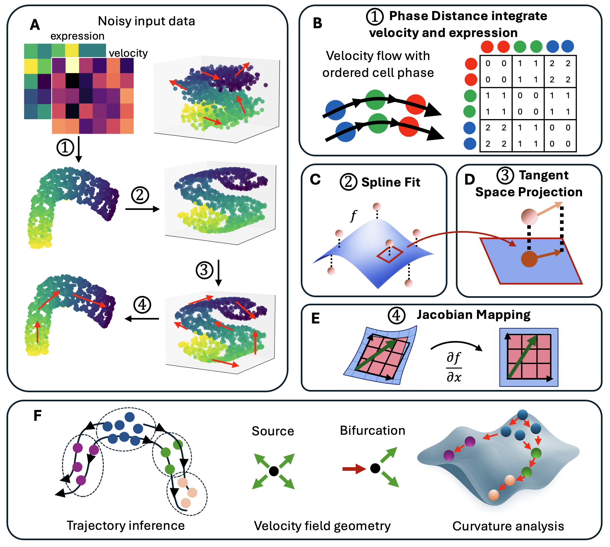

FlowMap
=======

.. raw:: html

   <section class="flowmap-hero">
     
Geometry-aware vector field embeddings

     

       FlowMap embeds high-dimensional expression and velocity data into a
       smooth low-dimensional geometry where cell-state flow can be visualized,
       compared, and analyzed.
     

     

       <a href="installation.html">Install</a>
       <a href="tutorials/index.html">Tutorials</a>
     

   </section>

   FlowMap integrates expression and velocity, fits smooth manifold geometry,
   maps vector fields into embedding space, and supports downstream dynamical
   analysis.

.. raw:: html

   <section class="flowmap-capabilities">
     

       <h2>Embed flow</h2>
       
Construct embeddings that respect both cell-state similarity and velocity direction.

     

     

       <h2>Map velocity</h2>
       
Use splines and Jacobians to project high-dimensional dynamics into embedding space.

     

     

       <h2>Analyze geometry</h2>
       
Study trajectories, fixed points, curvature, and gene-level gradients.

     

   </section>

.. toctree::
   :maxdepth: 2
   :hidden:

   introduction
   installation
   tutorials/index
   api
   references
