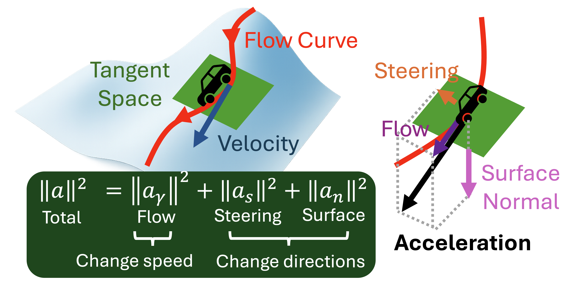
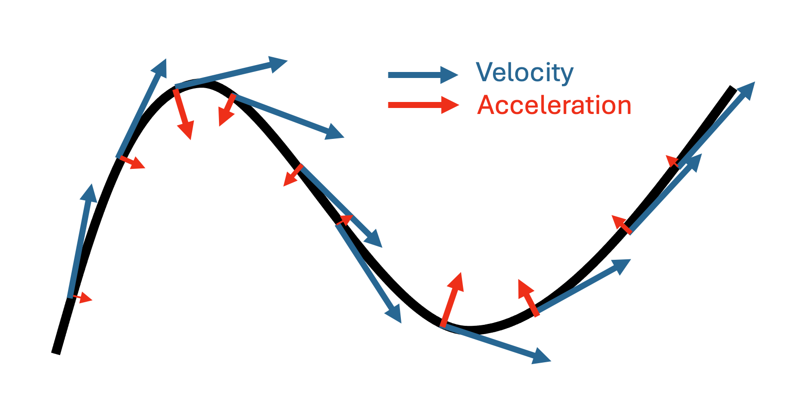
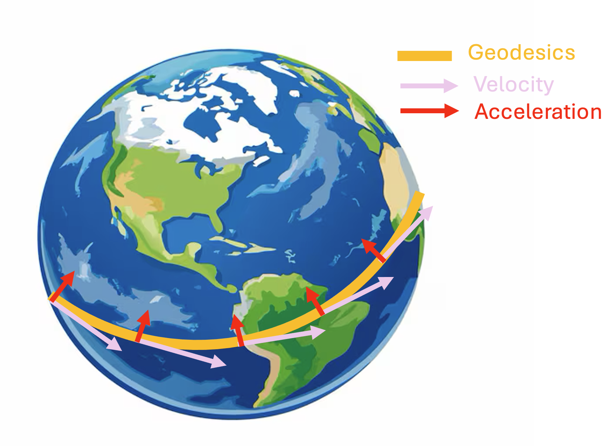

Curvature Analysis
==================

Once velocity is represented on the cell state manifold, FlowMap can analyze
how the vector field changes along its own trajectories. Curvature summarizes
whether a local flow is approximately straight, turns within the manifold, or
bends because the manifold itself is curved in gene expression space.

Let :math:`x(t)` be a trajectory on the reconstructed expression manifold, with
velocity and acceleration

.. math::

   v = \frac{dx}{dt},
   \qquad
   a = \frac{dv}{dt}.

The magnitude of acceleration depends on the speed of the trajectory. To focus
on bending rather than speed, FlowMap uses the speed-normalized quantity

.. math::

   \kappa =
   \frac{\lVert a \rVert}{\lVert v \rVert^2}.

This is the usual scaling for curvature: the same geometric curve should not
look more curved merely because it is traversed faster.

   Acceleration separates into a component along the flow, a tangent component
   that changes direction, and a normal component induced by the surface.

The component of :math:`a` parallel to :math:`v` changes speed. Curvature is
controlled by the remaining components: a tangent steering term and a
surface-normal term.

.. math::

   \kappa^2
   =
   \kappa_{\mathrm{steer}}^2
   +
   \kappa_{\mathrm{surface}}^2.

The steering term is the part of acceleration that lies in the tangent space
but is orthogonal to the velocity. It changes the direction of the flow curve
within the manifold.

   Steering acceleration is tangent to the manifold and perpendicular to the
   velocity, so it turns the flow curve.

The surface term is the normal component of acceleration. It appears when the
trajectory follows a curved manifold embedded in gene expression space. Even if
the flow direction changes little within the tangent plane, the lifted
trajectory can still bend in the ambient space.

   Surface acceleration points normal to the manifold and measures how the
   expression surface bends along the trajectory.
