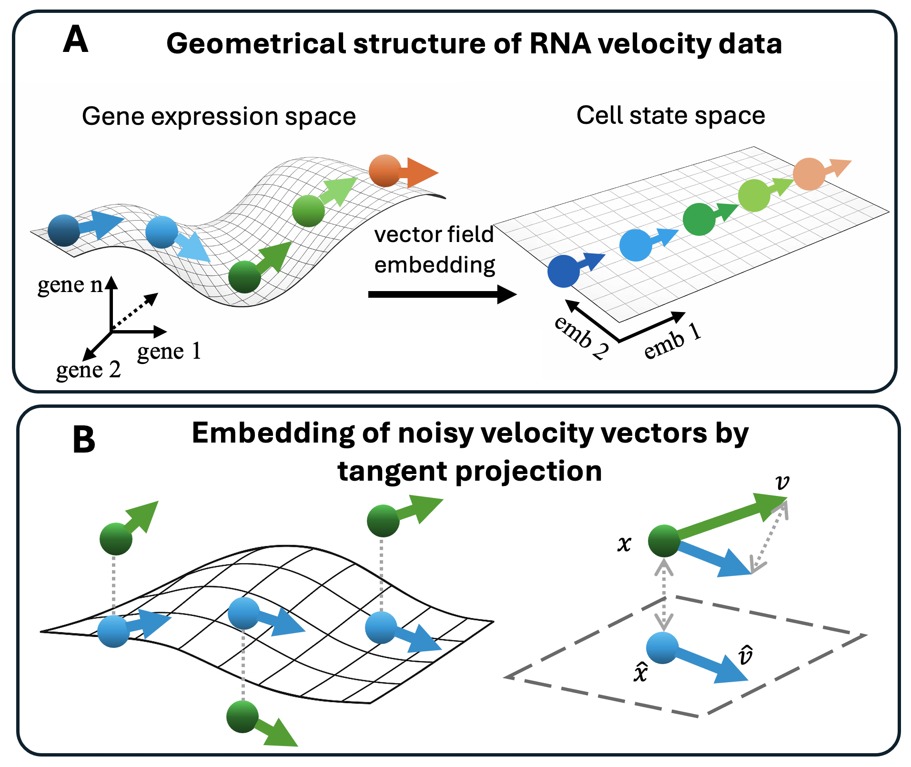

RNA Velocity Geometry
=====================

FlowMap starts from a simple geometric view of RNA velocity. Each cell has a
position in high-dimensional gene expression space and a velocity vector that
points toward its predicted future expression state. A low-dimensional cell
state embedding should preserve both pieces: where the cells are, and how they
move.

   FlowMap learns a smooth relationship between a low-dimensional cell state
   space and the high-dimensional gene expression space, then projects velocity
   vectors through this local geometry.

Two Spaces
----------

Let the low-dimensional embedding coordinate of a cell be
:math:`z \in \mathbb{R}^d`, and its gene expression vector be
:math:`x \in \mathbb{R}^p`, where usually :math:`d \ll p`.

FlowMap treats the embedding as a cell state space and learns a smooth map

.. math::

   f: \mathbb{R}^d \rightarrow \mathbb{R}^p,
   \qquad x \approx f(z).

In words, the map :math:`f` tells us how a point on the embedding corresponds
to a point on the gene expression manifold.

The Spline Bridge
-----------------

FlowMap represents :math:`f` with a smooth spline fitted from embedded cell
coordinates back to gene expression space:

.. math::

   f(z) =
   \sum_{k=1}^{K} w_k \, \phi(\lVert z - c_k \rVert)
   + A z + b.

Here, the control points :math:`c_k` define smooth local basis functions,
the weights :math:`w_k` reconstruct gene expression, and the affine term
:math:`Az + b` captures broad linear structure. This gives a smooth surface
over the embedding instead of treating cells as isolated points.

Projecting Velocity
-------------------

RNA velocity is observed in gene expression space as
:math:`v = dx/dt`. To draw that velocity on the embedding, FlowMap asks:
which embedded velocity :math:`u = dz/dt` best explains the observed
high-dimensional velocity?

The local linear approximation is given by the Jacobian of the spline:

.. math::

   \frac{dx}{dt}
   =
   J_f(z) \frac{dz}{dt},
   \qquad
   J_f(z)
   =
   \begin{bmatrix}
   \frac{\partial f_1}{\partial z_1} & \cdots & \frac{\partial f_1}{\partial z_d} \\
   \vdots & \ddots & \vdots \\
   \frac{\partial f_p}{\partial z_1} & \cdots & \frac{\partial f_p}{\partial z_d}
   \end{bmatrix}.

So the embedded velocity is obtained by projecting :math:`v` onto the tangent
space of the spline surface:

.. math::

   \hat{u}
   =
   \operatorname*{argmin}_{u}
   \left\lVert J_f(z)u - v \right\rVert^2
   =
   \left(J_f(z)^\top J_f(z)\right)^{-1}
   J_f(z)^\top v.

For a two-dimensional embedding, this becomes:

.. math::

   \begin{bmatrix}
   \hat{u}_1 \\
   \hat{u}_2
   \end{bmatrix}
   =
   \left(J^\top J\right)^{-1}J^\top
   \begin{bmatrix}
   v_1 \\
   v_2 \\
   \vdots \\
   v_p
   \end{bmatrix}.

This is the key geometric step: FlowMap does not simply attach arrows to an
embedding. It learns the local shape of the expression manifold and uses that
shape to translate high-dimensional RNA velocity into cell state motion.
