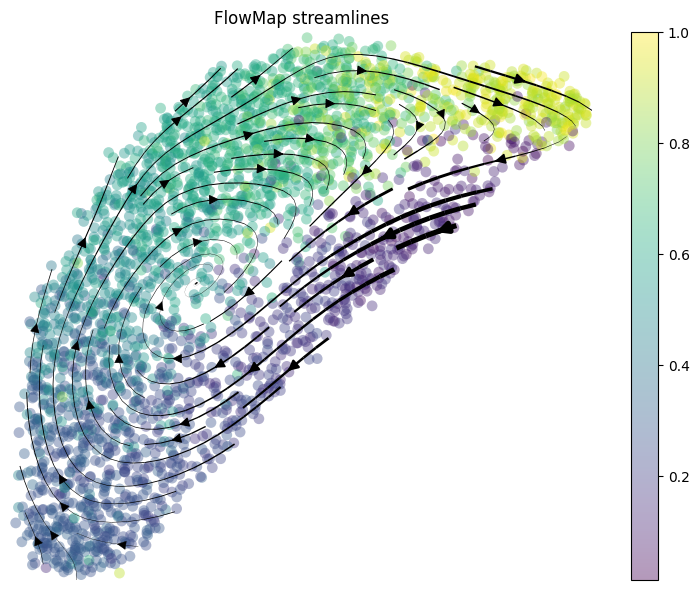
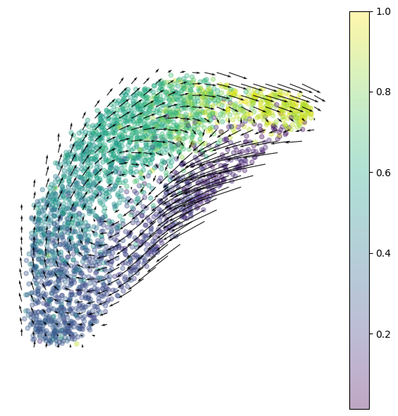
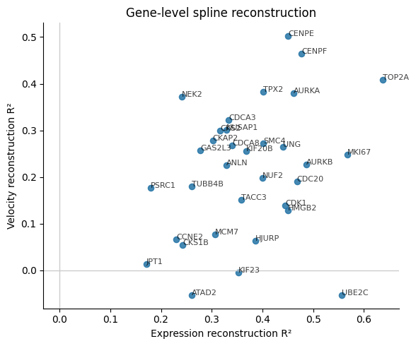

How to Perform FlowMap Embedding
================================

.. rubric:: Tutorials

:doc:`FlowMap embedding <cell_cycle>` ·
:doc:`Velocity embedding consistency <pancreas>`

This tutorial uses a compact cell-cycle AnnData object with 2,793 cells and
33 selected cell-cycle genes. Expression is stored in ``adata.X`` and velocity
is stored in ``adata.layers["velocity"]``.

Load Data
---------

.. code-block:: python

   import anndata as ad
   import numpy as np

   adata = ad.read_h5ad("example_data/cell_cycle/cell_cycle_33genes.h5ad")

   X = np.asarray(adata.X, dtype=float)
   V = np.asarray(adata.layers["velocity"], dtype=float)
   phase = adata.obs["cell_cycle_relative_pos"].to_numpy(dtype=float)
   gene_names = np.asarray(adata.var_names)

Fit FlowMap
-----------

.. code-block:: python

   from flowmap import VectorFieldEmbedder

   emb = VectorFieldEmbedder(
       X,
       V,
       use_PCA=False,
       method="umap",
       dist_method="phase",
       embedding_dim=2,
       knn_k=30,
       alpha=0.5,
       embed_kwargs={"n_neighbors": 30, "min_dist": 0.3},
   )

   emb.fit_embedding(seed=1)
   emb.fit_gene_level_splines(X=X, V=V, dof_gene=30, dof_vf_gene=30)

Plot Velocity
-------------

.. code-block:: python

   from flowmap.plot import plot_velocity_stream, plot_velocity_grid

   plot_velocity_stream(
       emb.X_emb,
       spline=emb.spline_vf,
       scatter_color=phase,
       grid_size=70,
       stream_density=1.2,
       scatter_size=60,
       scatter_alpha=0.4,
       cmap="viridis",
       show_colorbar=True,
   )

   Smooth streamlines show the inferred cyclic velocity field.

.. code-block:: python

   plot_velocity_grid(
       emb.X_emb,
       spline_vf=emb.spline_vf,
       scatter_color=phase,
       grid_size=25,
       scatter_size=20,
       scatter_alpha=0.35,
       arrow_scale=4.0,
       cmap="viridis",
       show_colorbar=True,
   )

   Grid arrows summarize the smoothed velocity field across the embedding.

Evaluate
--------

.. code-block:: python

   from flowmap.evaluation import SplineFitEvaluator

   evaluator = SplineFitEvaluator(emb, mode="gene")
   metrics = evaluator.evaluate()

   print(f"Mean expression R²: {metrics['expr_r2']:.3f}")
   print(f"Mean velocity R²:   {metrics['vel_r2']:.3f}")

The fitted gene-level splines give:

.. code-block:: text

   Mean expression R²: 0.371
   Mean velocity R²:   0.214

   Per-gene expression and velocity reconstruction scores.

The runnable notebook version is available at
``tutorial/cell_cycle_tutorial.ipynb``.
