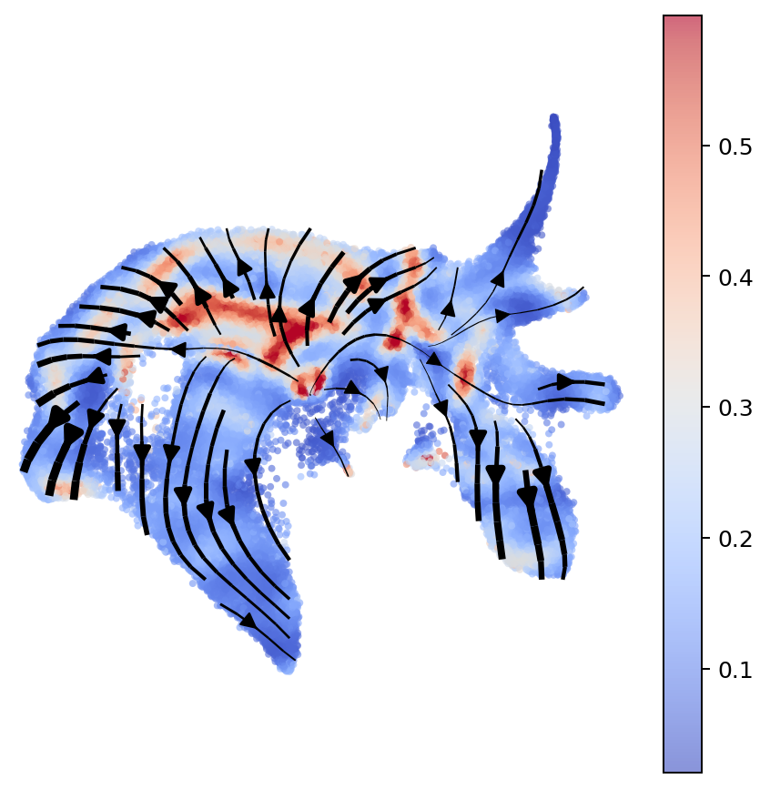
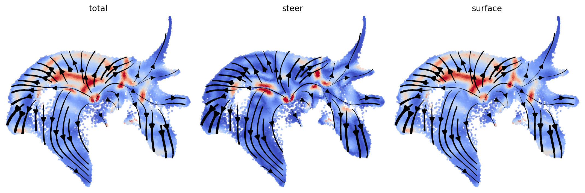
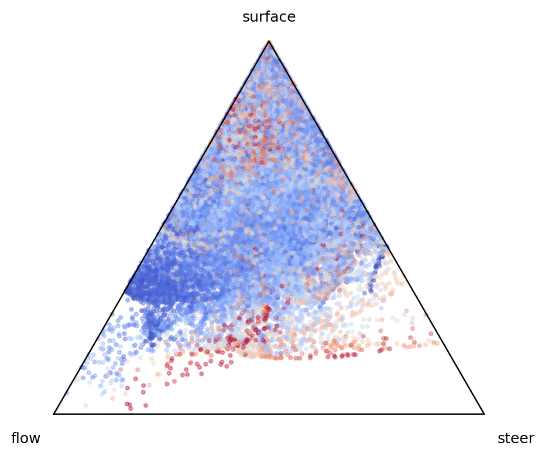

How to Perform Curvature Analysis
=================================

.. rubric:: Tutorials

:doc:`FlowMap embedding <cell_cycle>` ·
:doc:`Velocity embedding consistency <pancreas>` ·
:doc:`Trajectory and gene gradients <larry_geometry>` ·
:doc:`Curvature analysis <larry_curvature>`

This page shows the core FlowMap call for curvature analysis. The runnable
notebook is available at ``tutorial/larry_curvature_tutorial.ipynb``.

Load Data
---------

The Larry data object is not included in the GitHub repository; download it
from Figshare and place it at ``tutorial/larry_flowmap_data.joblib`` before
running the notebook.

Data link:
`Larry Data Processed with FlowMap <https://figshare.com/articles/dataset/Larry_Data_Processed_with_FlowMap/32258700?file=64501479>`_

.. code-block:: python

   from flowmap.utils import load_dataset

   data = load_dataset("tutorial/larry_flowmap_data.joblib")
   emb = data.embedder

Compute Curvature
-----------------

``compute_flow_curvature`` evaluates the fitted manifold spline and velocity
spline, then returns velocity, acceleration components, and curvature estimates.

.. code-block:: python

   from flowmap.geometry import compute_flow_curvature

   curv = compute_flow_curvature(emb)

   k_total = curv["curvature"]["total"]
   k_steer = curv["curvature"]["steer"]
   k_surface = curv["curvature"]["surface"]

Total Curvature
---------------

The total curvature combines intrinsic steering curvature and surface
curvature:

.. math::

   \kappa_{\mathrm{total}}
   =
   \sqrt{
      \kappa_{\mathrm{steer}}^2
      +
      \kappa_{\mathrm{surface}}^2
   }.

.. code-block:: python

   fig, ax = plt.subplots(figsize=(6, 6))
   plot_velocity_stream(
       emb.X_emb,
       spline=emb.spline_vf,
       scatter_color=np.clip(k_total, None, np.percentile(k_total, 99)),
       cmap="coolwarm",
       scatter_size=10,
       scatter_alpha=0.6,
       show_colorbar=True,
       ax=ax,
   )
   plt.show()

   Total curvature shown on the Larry FlowMap embedding.

Decomposed Curvature
--------------------

FlowMap separates acceleration into flow, steering, and surface components.
The curvature terms are acceleration magnitudes normalized by squared speed:

.. math::

   \kappa_{\mathrm{steer}}
   =
   \frac{\|A_{\mathrm{steer}}\|}{\|v\|^2},
   \qquad
   \kappa_{\mathrm{surface}}
   =
   \frac{\|A_{\mathrm{surface}}\|}{\|v\|^2}.

.. code-block:: python

   fig, axes = plt.subplots(1, 3, figsize=(12, 4))

   for ax, values, title in zip(
       axes,
       [k_total, k_steer, k_surface],
       ["total", "steer", "surface"],
   ):
       plot_velocity_stream(
           emb.X_emb,
           spline=emb.spline_vf,
           scatter_color=np.clip(values, None, np.percentile(values, 99)),
           cmap="coolwarm",
           scatter_size=8,
           scatter_alpha=0.6,
           ax=ax,
           title=title,
       )

   plt.tight_layout()
   plt.show()

   Total, steering, and surface curvature estimates.

Ternary Decomposition
---------------------

The acceleration dictionary contains ``flow``, ``steer``, and ``surface``
components. A ternary plot summarizes their relative contributions.

.. code-block:: python

   A_flow = np.linalg.norm(curv["acceleration"]["flow"], axis=1)
   A_steer = np.linalg.norm(curv["acceleration"]["steer"], axis=1)
   A_surface = np.linalg.norm(curv["acceleration"]["surface"], axis=1)

   total = A_flow + A_steer + A_surface + 1e-12
   flow_frac = A_flow / total
   steer_frac = A_steer / total
   surface_frac = A_surface / total

   x = steer_frac + 0.5 * surface_frac
   y = (np.sqrt(3) / 2) * surface_frac

   fig, ax = plt.subplots(figsize=(5.8, 5.2))
   ax.scatter(
       x,
       y,
       s=6,
       c=np.clip(k_total, None, np.percentile(k_total, 99)),
       cmap="coolwarm",
       alpha=0.35,
   )

   tri_x = [0, 1, 0.5, 0]
   tri_y = [0, 0, np.sqrt(3) / 2, 0]
   ax.plot(tri_x, tri_y, color="black", lw=1)
   ax.text(-0.03, -0.04, "flow", ha="right", va="top")
   ax.text(1.03, -0.04, "steer", ha="left", va="top")
   ax.text(0.5, np.sqrt(3) / 2 + 0.04, "surface", ha="center", va="bottom")
   ax.set_aspect("equal")
   ax.set_axis_off()
   plt.show()

   Relative flow, steering, and surface acceleration contributions.
