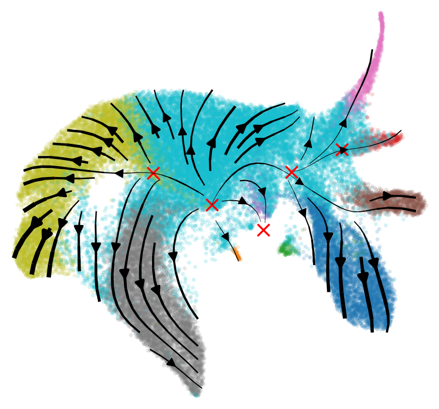
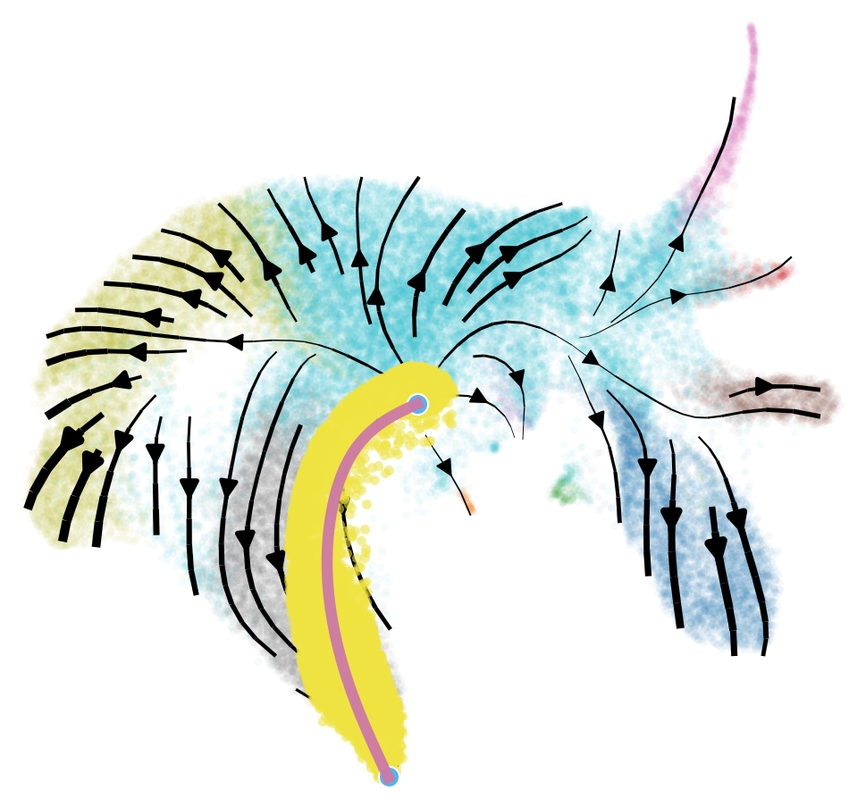
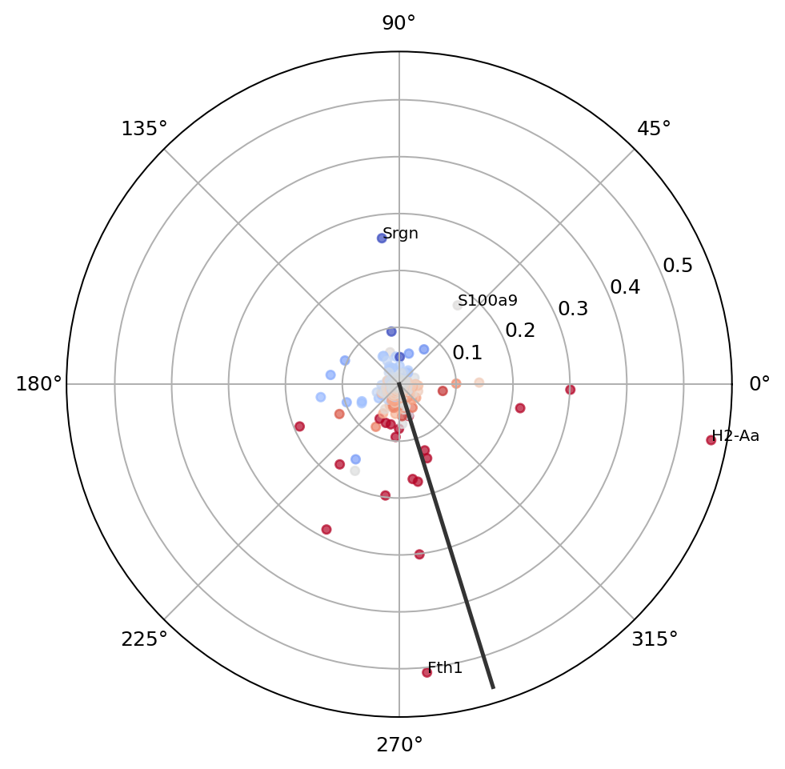
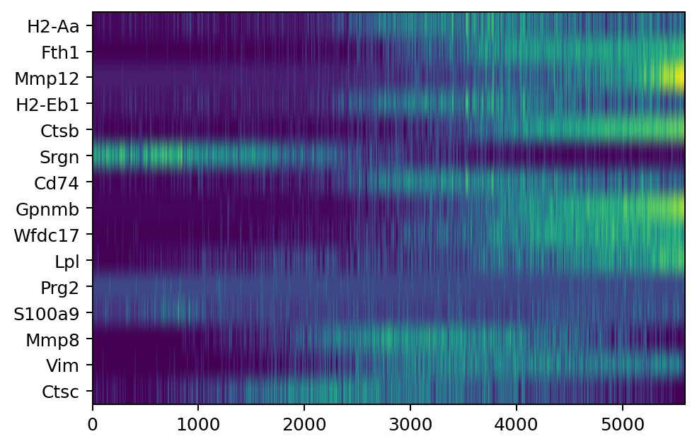
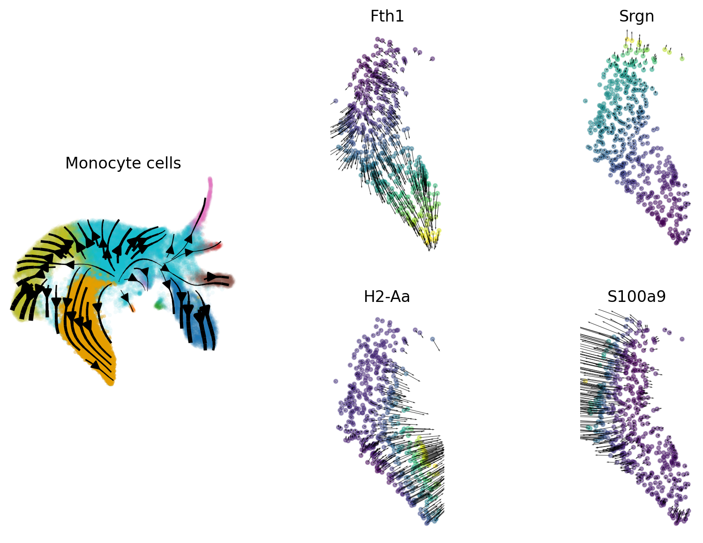

How to Perform Trajectory and Gene Gradient Field Analysis
==========================================================

.. rubric:: Tutorials

:doc:`FlowMap embedding <cell_cycle>` ·
:doc:`Velocity embedding consistency <pancreas>` ·
:doc:`Trajectory and gene gradients <larry_geometry>` ·
:doc:`Curvature analysis <larry_curvature>`

This page shows the core FlowMap calls for fixed points, least-action paths,
and gene-gradient analysis. Data loading and plotting are kept in the runnable
notebook:

``tutorial/larry_geometry_tutorial.ipynb``

Load Data
---------

The tutorial uses a ``.joblib`` wrapper that stores the fitted embedder with
the few metadata fields and gene matrices used below. The file is not included
in the GitHub repository; download or generate it and place it at
``tutorial/larry_flowmap_data.joblib`` before running the notebook.

.. code-block:: python

   from flowmap.utils import load_dataset

   data = load_dataset("tutorial/larry_flowmap_data.joblib")
   emb = data.embedder
   X_gene = data.layers["spliced"]
   V_gene = data.layers["velocity"]

Fixed Points
------------

Fixed points are places where the fitted velocity field is close to zero.
FlowMap identifies candidates on a grid, smooths the speed field, and keeps
low-speed regions.

.. code-block:: python

   from flowmap.geometry import FixedPointAnalyzer

   fpa = FixedPointAnalyzer(emb)
   fixed_points = fpa.identify_fixed_points(
       grid_resolution=90,
       speed_smoothing=1.2,
       speed_quantile_threshold=0.06,
   )

   Fixed points marked on the fitted FlowMap velocity field.

Least-Action Path
-----------------

A least-action path connects two points under the fitted velocity field. The
main choices are the ``start`` and ``end`` positions. Here the graph
initialization is built in the original feature space.

.. code-block:: python

   from flowmap.geometry import LagrangianPathOptimizer

   start = fixed_points[0]["position"]
   end = np.array([2.3, -7.6])

   lap = LagrangianPathOptimizer(emb, D=1.0, lam=1e-4)
   path_result = lap.fit_path(
       start=start,
       end=end,
       distance_mode="orig",
   )

   path = path_result["path_refined"]

   The selected path and nearby cells used for local gene-gradient analysis.

Gene-Level Splines
------------------

Gene-gradient analysis needs a spline from FlowMap coordinates back to gene
expression and gene velocity.

.. code-block:: python

   emb.n_spline_points = None
   emb.fit_gene_level_splines(
       X=X_gene,
       V=V_gene,
       dof_gene=50,
       dof_vf_gene=50,
   )

Gene Gradients
--------------

The gradient analyzer computes gene-expression gradients relative to the local
velocity direction. Pass only cells near the path so the Jacobian computation
stays local.

.. code-block:: python

   from flowmap.geometry import GeneGradientAnalyzer

   analyzer = GeneGradientAnalyzer(
       emb,
       cell_indices=neighbor_indices,
   )

   out = analyzer.compute_relative_gradients(
       neighbor_indices,
       np.arange(len(emb.gene_names)),
       weight="magnitude",
   )

   gradient_df = pd.DataFrame({
       "gene_idx": out["gene_indices"],
       "gene": emb.gene_names[out["gene_indices"]],
       "relative_angle": out["angles"],
       "magnitude": out["magnitudes"],
   })

   Path-local gene gradients summarized by direction and magnitude.

   Expression of top gradient genes after ordering nearby cells along the path.

   Monocyte cells on the embedding and example gene-gradient vectors for four
   selected genes.

The notebook contains the current plotting cells for visual inspection, but
the analysis itself is the four calls above.
