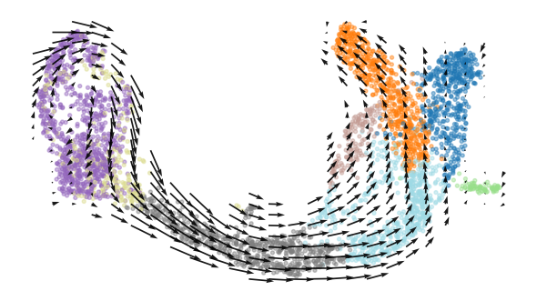
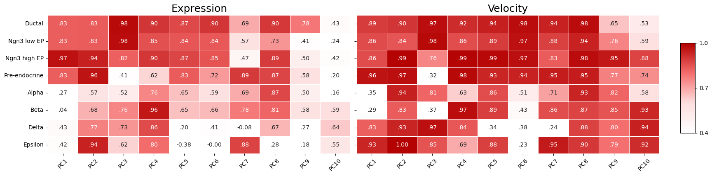
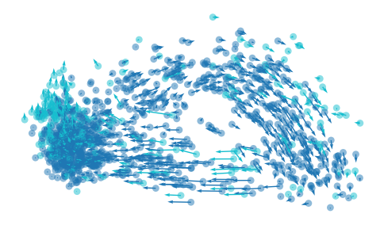
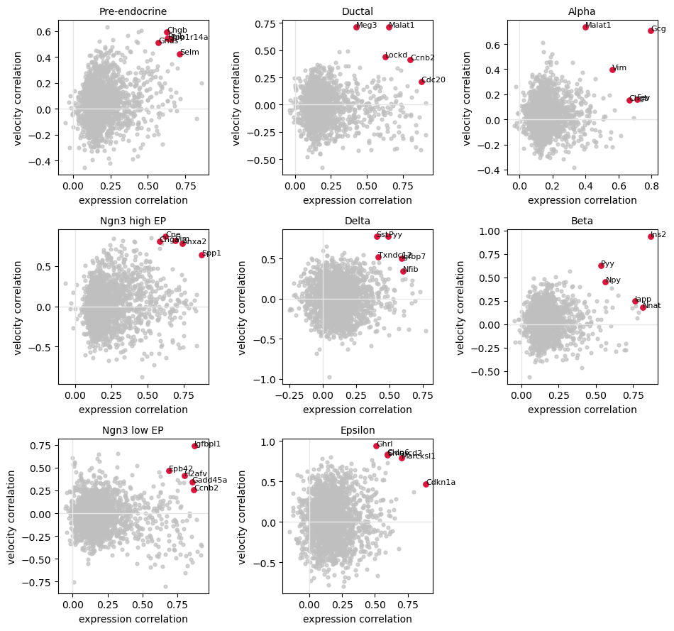

How to Evaluate the Consistency of the Velocity Embedding
=========================================================

.. rubric:: Tutorials

:doc:`FlowMap embedding <cell_cycle>` ·
:doc:`Velocity embedding consistency <pancreas>`

This tutorial uses the scVelo pancreas AnnData file. Download it manually from
Figshare to keep the same cells and genes across runs:

https://figshare.com/articles/dataset/scvelo-pancreas_h5ad/16547649?file=30595479

Place the file at ``data/scvelo-pancreas.h5ad``, or change ``DATA_PATH`` below.

Load Data
---------

.. code-block:: python

   from pathlib import Path

   import numpy as np
   import pandas as pd
   import scanpy as sc
   import scvelo as scv
   from scipy import sparse
   from sklearn.decomposition import PCA
   from sklearn.preprocessing import StandardScaler

   DATA_PATH = Path("data/scvelo-pancreas.h5ad")
   adata = sc.read_h5ad(DATA_PATH)

Recompute PCA
-------------

When the input dimension is high, such as thousands of genes, it is recommended
to perform the embedding-level FlowMap fit in PC space.

.. code-block:: python

   def to_dense(x):
       return x.toarray() if sparse.issparse(x) else np.asarray(x)

   hvg_mask = adata.var["highly_variable"].to_numpy(dtype=bool)
   X_scaled = StandardScaler().fit_transform(to_dense(adata[:, hvg_mask].X))

   pca = PCA(n_components=50, svd_solver="arpack", random_state=0)
   adata.obsm["X_pca"] = pca.fit_transform(X_scaled)

   pcs = np.zeros((adata.n_vars, 50))
   pcs[hvg_mask] = pca.components_.T
   adata.varm["PCs"] = pcs
   adata.uns["pca"] = {
       "variance": pca.explained_variance_,
       "variance_ratio": pca.explained_variance_ratio_,
   }

   scv.tl.velocity(adata, vkey="stochastic_velocity", mode="stochastic")
   scv.tl.velocity_graph(adata, vkey="stochastic_velocity")
   scv.tl.velocity_embedding(adata, basis="pca", vkey="stochastic_velocity")

Fit FlowMap Spline
------------------

FlowMap can work with existing embeddings. Passing ``X_emb`` keeps the given
UMAP coordinates and fits the spline maps directly on that embedding.

.. code-block:: python

   from flowmap import VectorFieldEmbedder

   X_pca = np.asarray(adata.obsm["X_pca"])
   V_pca = np.asarray(adata.obsm["stochastic_velocity_pca"])
   X_emb = np.asarray(adata.obsm["X_umap"])

   emb = VectorFieldEmbedder(
       X_pca,
       V_pca,
       X_emb=X_emb,
       use_PCA=False,
       method="umap",
       dist_method="euclidean",
   )

   emb.fit_embedding(seed=0)

Plot Embedded Velocity
----------------------

.. code-block:: python

   from flowmap.plot import plot_velocity_grid

   cell_type = adata.obs["clusters"].astype(str).to_numpy()

   plot_velocity_grid(
       emb.X_emb,
       spline_vf=emb.spline_vf,
       scatter_color=cell_type,
       grid_size=25,
       scatter_size=8,
       scatter_alpha=0.45,
       arrow_scale=0.1,
       arrow_width=0.003,
       cmap="tab20",
   )

   The fitted embedded velocity field on the existing UMAP coordinates.

Evaluate PCs
------------

.. code-block:: python

   from flowmap.evaluation import SplineFitEvaluator

   def evaluate_pcs_by_cell_type(evaluator, labels, n_pcs=10):
       pc_labels = [f"PC{i + 1}" for i in range(n_pcs)]
       expr_rows, vel_rows = [], []

       for label in pd.unique(labels):
           idx = np.where(labels == label)[0]
           result = evaluator.evaluate(cell_idx=idx)
           expr_rows.append(pd.Series(result["expr_corr_gene"][:n_pcs],
                                      index=pc_labels, name=label))
           vel_rows.append(pd.Series(result["vel_corr_gene"][:n_pcs],
                                     index=pc_labels, name=label))

       return pd.DataFrame(expr_rows), pd.DataFrame(vel_rows)

   pc_expr_scores, pc_vel_scores = evaluate_pcs_by_cell_type(
       SplineFitEvaluator(emb, mode="default"),
       cell_type,
   )

   PC-level expression and velocity consistency by cell type.

Raw PC Velocity
---------------

The PC-level evaluation suggests that PC3 and PC8 have higher consistency with
the embedding. We can look at the raw velocity values directly in that PC space.

.. code-block:: python

   from flowmap.plot import plot_2d_quiver

   pc_x, pc_y = 2, 7
   X_pc = adata.obsm["X_pca"][:, [pc_x, pc_y]]
   V_pc = adata.obsm["stochastic_velocity_pca"][:, [pc_x, pc_y]]

   mask = np.isin(cell_type, ["Ductal", "Ngn3 low EP"])

   plot_2d_quiver(
       X_pc[mask],
       V_pc[mask],
       color=(cell_type[mask] == "Ngn3 low EP").astype(float),
       scale=0.4,
       size=40,
       alpha=0.5,
       cmap="tab10",
   )

   Raw RNA velocity projected onto PC3 and PC8.

Fit Gene Splines
----------------

By default, this tutorial fits FlowMap in PC space. For gene-level evaluation,
we can either use PC-level reconstruction as an approximation or refit splines
directly from the embedding to genes. Here we refit the gene-level splines.

.. code-block:: python

   gene_idx = np.flatnonzero(hvg_mask)
   X_gene = to_dense(adata.layers["spliced"][:, gene_idx]).astype(np.float32)
   V_gene = to_dense(adata.layers["stochastic_velocity"][:, gene_idx]).astype(np.float32)
   gene_names = adata.var_names[gene_idx].to_numpy()

   emb.fit_gene_level_splines(
       X=X_gene,
       V=V_gene,
       dof_gene=50,
       dof_vf_gene=50,
   )

Gene-Level Evaluation
---------------------

.. code-block:: python

   evaluator = SplineFitEvaluator(emb, mode="gene")
   metrics = evaluator.evaluate()

   Per-gene expression and velocity reconstruction within each cell type.

The runnable notebook version is available at
``tutorial/pancreas_tutorial.ipynb``.
